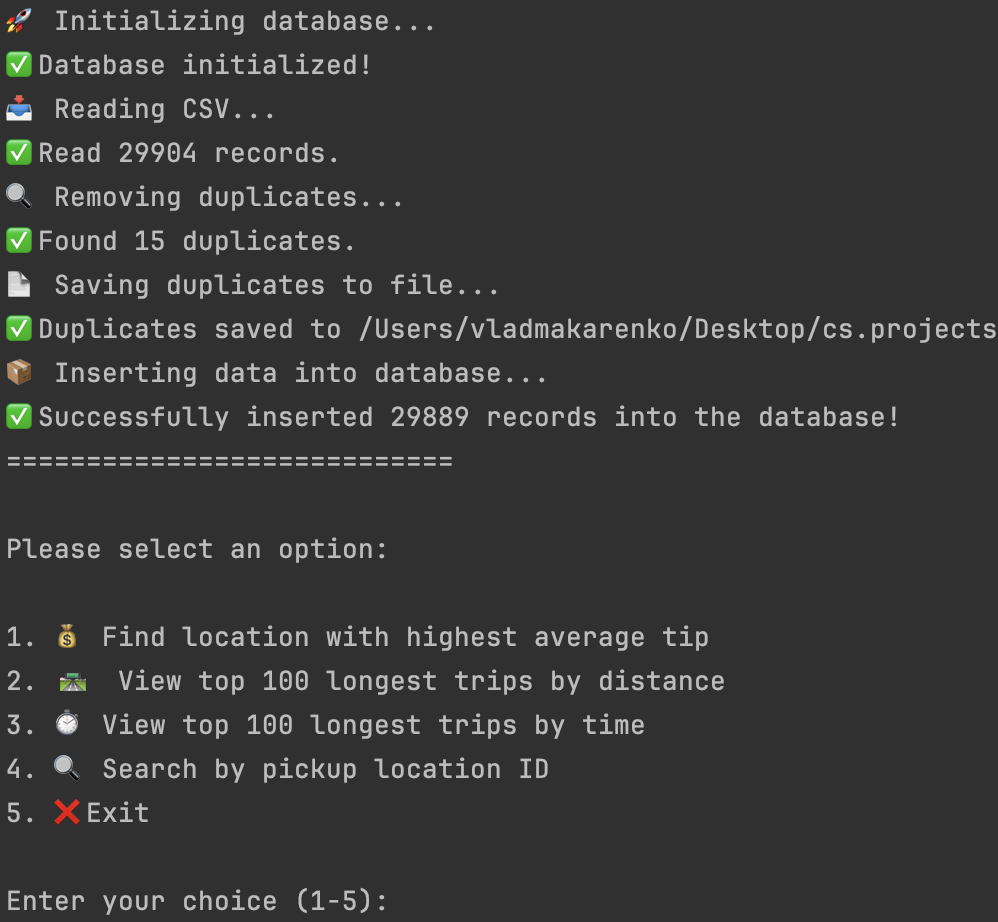

# ETL Test Task

This project implements a simple ETL (Extract, Transform, Load) process that reads data from a CSV file, processes it, and loads it into a Microsoft SQL Server database.

## Features

- Reads and processes CSV data
- Removes duplicates based on pickup time, dropoff time, and passenger count
- Saves duplicates to a separate CSV file
- Efficiently bulk inserts data into the database
- Provides query options for data analysis

## Application Flow

## Implementation Details

### Database Setup

All SQL scripts are contained in [SqlCommands.cs](https://github.com/VladMakarenko99/TestTaskDevelopsToday/blob/master/TestTaskDevelopsToday/Data/SqlCommands.cs).

### Data Processing

The application performs several data validation and transformation steps:
- Filters out negative values for fare amount, tip amount, passenger count, and trip distance
- Converts 'Y' to 'Yes' and 'N' to 'No' for the store_and_fwd_flag field
- Trims whitespace from all text fields
- Identifies and removes duplicate records

### Bulk Insertion

The application uses SqlBulkCopy with a batch size of 1000 for efficient database insertion.

## Results

- **Total records read from CSV**: 29,904
- **Duplicates found and removed**: 15
- **Records inserted into database**: 29,889

## Optimizations for Large Datasets

For handling larger datasets (e.g., 10GB CSV files), the following optimizations would be implemented:

1. Streaming processing of CSV in chunks
2. Parallel processing for data transformation
3. Optimized bulk insert batch sizes
4. Progress reporting

## Assumptions and Design Decisions

1. Data integrity is maintained by filtering out negative values
2. Database schema includes appropriate constraints
3. Indexes on PULocationID, trip_distance, and datetime fields optimize queries
4. The application prioritizes data integrity over processing speed
